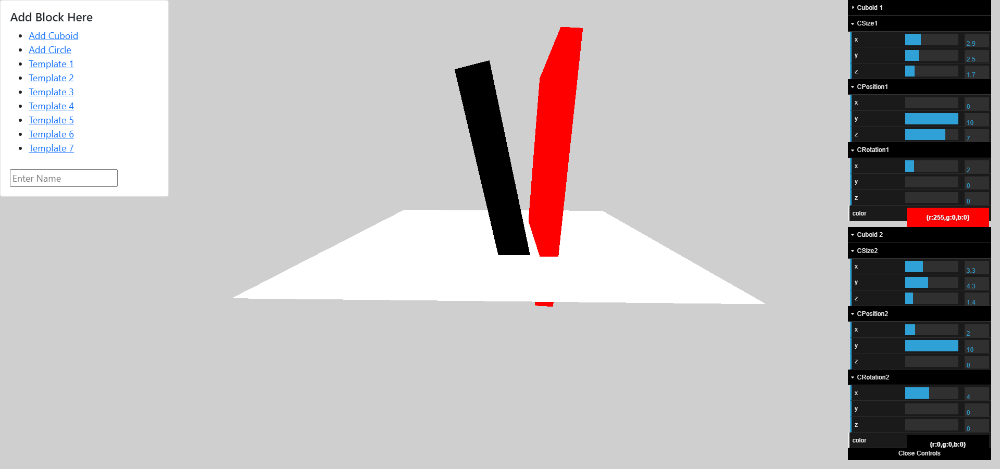
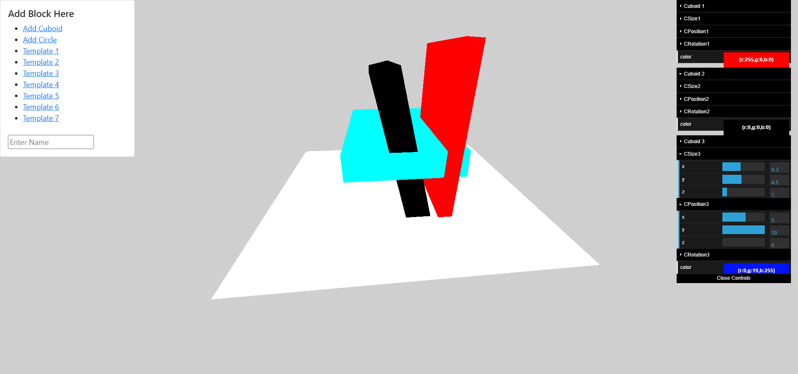

# ThreeDModel Three.js Angular Gtlf loader

This project was generated with [Angular CLI](https://github.com/angular/angular-cli) version 11.2.10.

## Development server

Run `ng serve` for a dev server. Navigate to `http://localhost:4200/`. The app will automatically reload if you change any of the source files.

## Build

Run `ng build` to build the project. The build artifacts will be stored in the `dist/` directory. Use the `--prod` flag for a production build.

The templates are saved in the src/assets and contains the credit file for the people who created those amazing templates.
## Add 3D objects dynamically
We can create 3D modeling open source platform for the web and people can integrate the same in their projects.

## Add 3D objects dynamically
This platform currently allows users to add cuboids, sphere and templates with a click of a button and users can use the GUI to change color,position, height , width, depth,rotation.

